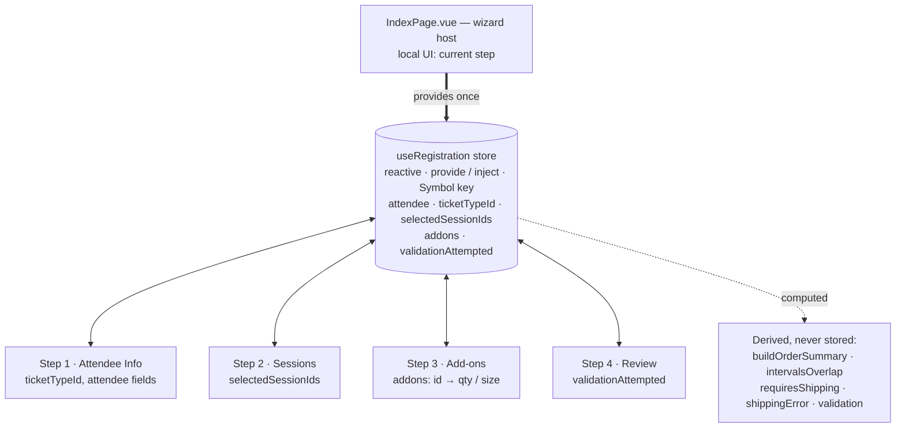

# PLAN.md — Development Journal

> Event Registration Wizard · WebDev Summit 2028 · Nitra FE Assessment
> This is a living document, updated as the work progresses.

---

## 1. Planning & task breakdown

I read both the assignment brief (authoritative) and `README.md` (step-level spec) before starting. The app is a 4-step wizard backed entirely by mock data in `src/mocks/` — no backend. I broke the work into phases, each landing as its own atomic commit so the history reflects the real build order:

0. **Scaffold** — folder structure, dependencies, i18n boot, `QStepper` shell, shared cross-step state via a composable + `provide`/`inject`, empty step components wired to navigation.
1. **Step 1 — Attendee Info** — text/email/tel fields via `defineModel`, three single-select ticket cards. No inline validation (deferred to Step 4 per spec).
2. **Step 2 — Session Selection** — parse + group sessions by day, capacity-full disabled state, multi-select, conflict-detection groundwork.
3. **Step 3 — Add-ons** — group by category (workshops / meals / merchandise), workshop↔session time-conflict → unavailable, size + quantity pickers, shipping banner on merch selection, live order summary.
4. **Step 4 — Review & Submit** — itemized summary, per-section edit-jump, unified validation across all steps, step-level error indicators + navigation, success screen.
5. **Design fidelity pass** — match the Figma design, all interactive states (hover / disabled / error / active), semantic tokens only.
6. **Polish & nice-to-haves** — transitions, loading/disabled states, i18n coverage, responsive/mobile layout.

## 2. Architecture & key decisions

**Cross-step state — composable + `provide`/`inject`.**
A single `useRegistration` composable owns the wizard's reactive state (attendee info, ticket type, selected session IDs, selected add-ons with size/quantity). `IndexPage.vue` provides it once; each step injects it. This keeps all form data alive across forward/backward navigation without prop-drilling, and is the pattern the brief calls out explicitly. Pinia would be overkill for a single-wizard, single-route app and isn't in the starter.

The store (`src/composables/useRegistration.js`) is the only source of truth — it holds raw user input/selections; everything else (pricing, conflicts, field/validation states) is derived with `computed` and never duplicated. The "current step" is local UI state in `IndexPage`, deliberately kept out of the registration store.

**Derived state via `computed`, not `watch`.**
Pricing totals, VIP discounts, time conflicts, capacity/availability flags, and validation results are all pure functions of the source state, so they're modeled as `computed`. `watch` is reserved for genuine side effects only. (This is a stated evaluation criterion and also simply correct here.)

**`defineModel` for form inputs.**
Vue 3.5 (repo pins 3.5.17) supports `defineModel`, so two-way-bound field components use it instead of manual `modelValue` + `update:modelValue`.

**Component decomposition.**
Step containers (`StepAttendeeInfo`, `StepSessionSelection`, `StepAddons`, `StepReview`) compose small presentational components (`TicketCard`, `SessionCard`, `AddonCard`, `MerchandiseCard`, `OrderSummary`, `QuantityPicker`, `ReviewSection`, `SuccessScreen`). Business logic lives in **pure, dependency-free utils** (`utils/pricing`, `utils/validation`, `utils/datetime`, `utils/currency`) rather than composables — they take state in and return data out, so they're trivially testable and the components stay presentational. The one composable, `useRegistration`, owns *state*, not logic.

**Time-conflict algorithm.**
Two intervals overlap iff `aStart < bEnd && bStart < aEnd` (compared on epoch millis). One helper serves both session↔session and workshop↔session checks. The mock data ships intentional overlaps (documented in `sessions.js`) to exercise this.

**Pricing rules.**
Grand total = ticket price + Σ add-ons. Workshops get **10% off for VIP** ticket holders; merchandise multiplies price × quantity; sessions are free. All currency rendered as `$X,XXX.XX`.

**Validation strategy — one zod schema, run by vee-validate, many surfaces.**
No inline validation runs before Step 4. The rules live in a single **zod** schema (`utils/validation.js`): required attendee fields, email/phone format, ticket selection, plus the cross-step business rules in one `superRefine` — conditional shipping (when merchandise is selected), session↔session time conflicts, and merchandise-size-not-chosen. Messages are i18n **keys**, not strings. **vee-validate** runs the schema: the store sets up `useForm({ validationSchema: toTypedSchema(registrationSchema) })`, and because inputs stay bound to the central store (not to vee-validate fields), Step 4's Submit pushes the flattened store values in and calls `validateAll()` imperatively. The flat `{ path: messageKey }` result is reshaped once into the structure the views consume — a step-tagged issue list (path → step via a small map), a per-field lookup, and per-step error flags — exposed as a shared `computed` (`validation`). So every surface reads the same result: Step 1 shows per-field errors, Step 4 shows the error banner + red section borders, and the stepper marks the offending steps. Everything is gated behind a `validationAttempted` flag that only Submit flips; after that first attempt a `watch` on the store re-runs validation so errors clear/reappear live. On failure the wizard stays on Review, scrolls to + focuses the banner, and surfaces every issue (banner + Edit links + red stepper) so the user can jump straight to a problem; on success it generates a confirmation number and shows the success screen.

> **Why a library here (and why not the hand-rolled version I started with).** I first wrote the validator by hand. It worked, but the field-format rules (email/phone regex especially) are exactly the brittle, easy-to-get-subtly-wrong part that a tested schema library removes. zod gives declarative, composable rules as a single source of truth; vee-validate is the Vue-native orchestration layer for running it. The honest caveat: vee-validate's headline value is per-*field* binding (touched/dirty/blur), which this app deliberately doesn't use — state is a central store and validation is a single deferred submit. So vee-validate is used in its imperative `useForm().validate()` mode, and the field params zod can carry (e.g. the names in a conflict message) are flattened away by the vee-validate adapter, so those two messages are phrased generically. A reasonable alternative would have been zod alone; vee-validate was chosen to use the Vue-ecosystem standard and to leave room for per-field UX later.

**Track badge colours — deterministic, not copied from the mockup.**
The Figma colours the session-track badges inconsistently: two FRONTEND sessions get different colours (one orange `orange/50`+`orange/600`, one yellow `yellow/200`+`yellow/900`), so there is no per-track rule to copy. I instead assigned one distinct palette colour per track — `main → gray`, `frontend → orange`, `backend → blue`, `devops → yellow` — so the colour actually encodes the track (a blue badge always means backend). Full/disabled sessions mute the badge to gray, matching the design's disabled card. Judgment call: a consistent mapping beats faithfully reproducing the mockup's ad-hoc colouring.

**Design-source observations — inconsistencies in the Figma, and how I resolved them.**
A couple of places where the design source contradicts itself; in each I implemented one consistent rule rather than reproducing the artifact, and noted it here so the deviation is intentional and reviewable:

1. **Label / badge colours aren't defined as a clear rule.** Beyond the track badges above, the design has no single token mapping for its category/label colours — the same semantic label is coloured differently across frames. Rather than copy per-frame colours, I derive colours from a deterministic rule (per-track palette for session badges; semantic tokens everywhere else).

2. **An undocumented brand-coloured/bold line in the order summary — read as "merchandise".** In the source, one summary line is rendered in the brand colour and visually heavier (teal, bold) with no documented reason (Figma: a 13px `text/brand/emphasis` label vs. the muted `body/sm` lines around it). It first looked like an arbitrary "last item" highlight, but the highlighted line is consistently a **merchandise** product (e.g. the teal `Sticker Pack × 3` line). I read the design's intent as *merchandise line items are visually distinguished from the ticket / workshop / meal lines* — which gives the highlight a meaning (it marks the shippable goods) instead of landing on whatever item happens to be last. So merchandise summary lines render in `text-brand-emphasis` (medium weight) while the others stay muted, applied consistently in both the live order summary (Step 3) and the review pricing (Step 4); the discount stays its own brand-coloured line and only the Total is bold. This is an interpretation — the source never states the rule — but a consistent, meaningful one beats reproducing the artifact verbatim.

## 3. Dependency choices

Added runtime dependencies: **vue-i18n**, and **vee-validate** + **@vee-validate/zod** + **zod** for validation.

| Dependency | Problem it solves | Alternatives considered |
| ---------- | ----------------- | ----------------------- |
| **vue-i18n** | i18n is a listed nice-to-have; baking it in from the start avoids a costly retrofit of every hardcoded string later. Quasar has first-class integration. | Hand-rolled message map (no pluralization/number-format infra); deferring i18n (rejected — far cheaper to do up front). |
| **zod** | Declarative, well-tested schema for the unified validation — replaces hand-rolled regex/required checks that are easy to get subtly wrong. One source of truth for every rule. | Hand-rolled validator (works, but brittle email/phone rules); yup (similar, but zod is the more modern Vue/TS-ecosystem default). Pinned to **v3** (`^3.25`) because `@vee-validate/zod` peer-requires zod `^3.24`. |
| **vee-validate** + **@vee-validate/zod** | The Vue-native way to run a schema and orchestrate submit-time validation. `toTypedSchema` adapts the zod schema; `useForm().validate()` runs it. | zod alone (would have been lighter — vee-validate's per-field binding is unused here since state is a central store + deferred submit). Chosen to use the ecosystem standard and leave room for per-field UX. **Trade-off noted in §2.** |

> **date-fns — evaluated, then removed.** It was added during scaffolding for date handling, but the session/workshop timestamps are fixed UTC ISO strings (`…Z`) and the design renders them as UTC wall-clock times (`09:00Z` → "9:00 AM" for every viewer). `Intl.DateTimeFormat({ timeZone: 'UTC' })` does this correctly in one call, whereas date-fns' `format()` runs in the viewer's local zone — matching the design would have meant adding `date-fns-tz` on top. Time formatting, day-grouping and interval-overlap are all trivial with native `Date`/`Intl` (`src/utils/datetime.js`), so date-fns was removed rather than left as an unused dependency. Currency uses the built-in `Intl.NumberFormat`.

## 4. Nice-to-haves (in scope)

- **i18n** via `vue-i18n` — all user-facing strings go through translation keys from day one.
- **Responsive / mobile** — layouts built mobile-first using the project's UnoCSS breakpoints (`tablet: 768px`, `desktop: 1024px`).

## 5. AI tool usage

Primary tool: **Claude Code** (interactive agent), used throughout. Notable sessions so far:

- **Environment upgrade.** The repo pins Node 22.17.0 / Yarn 4.6.0 but the machine was on Node 20 / Yarn 1. Claude diagnosed the toolchain (identified `n` as the active manager vs. a stray `nvm`), upgraded via `n` + Corepack, and cleaned up ~1.4 GB of redundant old Node versions. What worked: letting it inspect the environment first rather than guessing the version manager. Where I stayed in the loop: `sudo` steps were run by me, not the agent.
- **Onboarding docs.** Generated `CLAUDE.md` (architecture + conventions) and recorded the team convention that all in-file comments must be English.
- **Planning.** Used Claude to turn the brief + README into the phased plan and architecture decisions above, choosing patterns against the published evaluation weights.

**Representative prompts → corrections (Step 1).**
The most useful thing I did was treat the agent's output as a *draft* and keep probing it. A few of the real prompts that actually drove quality:

- *"Why use a `<button>` for the ticket card?"* — Claude confirmed a `<button>` wrapping `
/
/<ul>` is invalid HTML, and that a single-select group is semantically a radiogroup, then refactored the cards to a WAI-ARIA `radiogroup` (roles, `aria-checked`, roving `tabindex`, arrow-key nav, focus-visible ring).
- *"Where do those extra 13px come from?"* — I had it measure with Playwright instead of guessing: the label→input gap was 8px instead of the Figma's 6px (×4 rows = 8px); the remaining ~4px was a border-box-vs-Figma-frame measurement difference, not a real gap.
- *"Do we really need these inline `style` tags — don't we have UnoCSS?"* — moved the dividers and the 1200 width off inline styles into `divider-b` / `divider-t` and `wizard-shell` shortcuts.
- *"Why doesn't `q-py-[1.5]` change anything?"* — it's an invalid class, and a `q-btn`'s `min-height: 36px` floor swallows padding anyway; switched to Quasar's `padding` prop to hit the Figma 192×40 button.
- *"The completed stepper line should change colour."* — this caught an earlier wrong conclusion of mine-via-Claude ("connectors are a single grey"), which had been drawn from only the Step-1 state where nothing is completed.

**What worked / what didn't.**

| Worked | Didn't — needed steering |
| --- | --- |
| Handing Claude the Figma node via the MCP so it mapped to the repo's semantic tokens instead of inventing hex | First Step-1 pass "matched the tokens" but used the wrong typeface — looked off until we pulled the exact spec |
| Making it *measure* (Playwright) and screenshot-compare against Figma rather than eyeball | Concluded the stepper connectors were one colour from a single state; wrong once steps complete |
| Pulling exact values with `get_variable_defs` instead of guessing | Reached for inline `style` and a hardcoded stepper height instead of the token + shortcut system |
| Asking "why this element / value?" — surfaced the invalid `<button>` and the `q-btn` min-height floor | Used `<button>` with block content (invalid) and `q-py-[1.5]` (a class that doesn't exist) |

## 6. Challenges & solutions

- **Toolchain mismatch on a clean machine.** `yarn install` failed the engine check (Node 20 vs required 22). Resolved by standardizing on `n` for Node and Corepack for Yarn 4, so the versions are enforced by `package.json` (`engines` + `packageManager`) for any future checkout. Also added Yarn 4's `.gitignore` rules so the regenerable `.yarn/install-state.gz` cache isn't committed.

## 7. What I'd improve with more time

- **Persist state.** A page refresh loses the in-progress registration. With more time I'd mirror the store to `sessionStorage` (or the URL) so a reload — or an accidental Edit-link round-trip — keeps the user's selections.
- **Responsive.** The layout degrades sensibly below 1200px and the stepper collapses its labels, but a real mobile pass (<768px touch-target sizing, denser cards) isn't fully designed or tested — the Figma only ships a 1440 frame.
- **Tokenise a few arbitraries.** Spacing/radius now uses the numeric step scale (`p-4`, `rounded-2`); the values left in brackets are the genuinely off-scale ones — the 6px card radius (`rounded-[6px]` = the `border-radius/m` token) and small font sizes like `text-[11px]`/`text-[13px]` — which could become named tokens if the design system grows.
- **Tests.** Out of scope per the brief, but the pricing and time-conflict logic are the parts I'd most want unit/component tests around before trusting them.

## 8. Phase log

**Phase 0 — Scaffold.**
Added `vue-i18n` (and initially `date-fns`, later removed in the Step 2 phase once native `Intl` proved sufficient — see §3); wired vue-i18n via a Quasar boot file (`src/boot/i18n.js`, Composition mode) with an `en-US` locale registry under `src/i18n/`. Built the central state layer: `useRegistration.js` exposes `provideRegistration()` (called once in `IndexPage`) and `useRegistration()` (injected by steps), with the full typed state shape documented via JSDoc. `IndexPage.vue` hosts a `QStepper` (4 steps, `header-nav` for free forward/backward navigation, Back/Continue/Submit). Four step components are stubbed and rendered. Verified with a clean production build and a dev-server boot (no runtime errors).

- AI note: Claude scaffolded the i18n boot, composable, and stepper in one pass. I had it verify both `yarn build` and a real dev boot rather than trusting compile-only — runtime is where boot-file/provide-inject mistakes surface.

**Phase 1 — Attendee Info + shared chrome.**
Pulled the Step 1 design from Figma (via the hosted Figma MCP) and confirmed the token mapping: brand = teal (`#264D4F`, selection/active/checks), accent = orange (CTA). Replaced the placeholder `QStepper` with custom shared chrome that matches the design: `AppHeader` (logo + event name) and `WizardStepper` (numbered circles, done/active/upcoming states, clickable for free navigation). `IndexPage` now drives a step registry, renders the active step via `<component :is>`, and owns the footer Back/Next/Submit nav. Step 1 content: `TicketCard` (reusable, single-select, "Selected" badge) fed by `mocks/event.js`, and the attendee form built from a `LabeledInput` component using `defineModel` for two-way binding, two-column responsive grid, all bound to the shared state. All UI strings go through i18n keys; added `utils/currency.js` (Intl-based). Verified: clean build, dev boot with no warnings, and a headless-Chrome screenshot compared against the Figma frame.
- Design decision: the header shows "WebDev Summit 2028" (from `mocks/event.js` + the brief), not the Figma mockup's stale "2025" — the title is data-driven, not hardcoded.
- AI note: gave Claude the Figma node directly so it mapped colors to the repo's existing semantic tokens rather than inventing hex values. Figma MCP is rate-limited (Starter = 6 calls/month), so we cached one hi-res reference per screen and reused it instead of re-fetching.
- Course-correction (important): on first pass Claude matched layout + semantic color tokens but the result still didn't look like the design. Reviewing against the Figma, the typeface was wrong — Quasar ships no Roboto here so text fell back to the system font, while the design uses **Inter**. Rather than eyeballing, we spent one `get_variable_defs` call to pull the exact spec, which revealed: font = Inter, perk checks = green/700 (not teal), "Attendee Information" = h3/24 (not 28), input radius 6. Fixed all of them (self-hosted Inter via `@fontsource-variable/inter`, `text-success-emphasis` checks, corrected type scale). Lesson logged: "matches the tokens" ≠ "matches the design" — verify the typeface and exact values, not just the color names. The button color (`#fb7429`) was already correct.

**Phase 1 (cont.) — pixel pass, layout system & accessibility.**
A second pass against the Figma box-model annotations tightened Step 1 to spec and hardened the markup:
- **Layout system.** Full-bleed chrome (header / stepper / footer / dividers span the viewport) + a centered **1200px content column** (`max-width` + `mx-auto`), which is exactly how the 1440 artboard is structured (content frame at x=120, width 1200). Extracted a `wizard-shell` UnoCSS shortcut so the 1200 lives in one place; verified content sits at x=120 / width 1200 at 1440 and degrades on narrower screens. Rejected "fluid width + fixed padding" — it stretches content on >1440 and over-pads on small screens.
- **Exact spacing (Figma box model).** Content padding 40px top/bottom, 32px between sections, 20px between form rows, 16px ticket-title→cards. Removed default `<h2>` margins that were inflating the flex gaps. Stepper height is `padding 24px` over a 32px row (= 80px), not a hardcoded height.
- **Ticket cards — equal height with no reflow.** Selecting a card must never shift the row: the "Selected" badge is always rendered (hidden via `invisible`) to reserve its height, and the border is a constant 2px (only the colour changes). Cards stay a fixed 310px in every state.
- **Inputs.** `LabeledInput` field box matched to 44px tall with 12px / 10px padding (Quasar internals via scoped `:deep()` — utility classes can't reach `.q-field__control`).
- **Conditional shipping address.** Required (red asterisk) when any merchandise add-on is selected; danger label/border/message only after the unified Step 4 validation (`validationAttempted` flag) — keeps validation deferred per spec while the indicator stays live.
- **Styling discipline.** Moved one-off `style="…"` attributes onto UnoCSS utilities/shortcuts (`divider-b`/`divider-t` draw the 1px hairline via inset shadow so it never adds to box height; `wizard-shell`, `min-h-screen`, `bg-surface-l0`, `max-w-[1200px]`). Token references only — no hardcoded hex.
- **Accessibility — ticket picker is a WAI-ARIA radiogroup.** `<button>`-with-block-content was invalid HTML, and a single-select group is semantically a radiogroup, so the cards became `role="radio"` (inside `role="radiogroup"` labelled by the heading) with `aria-checked`, roving `tabindex`, arrow-key navigation with wraparound, Enter/Space select, and a `focus-visible` ring.
- AI notes / course-corrections (logged because they show where I steered the agent): (1) Claude first bumped the unselected border to 2px to kill a reflow — I flagged Figma's 1px; we kept a constant-width border and reserved badge space instead. (2) It reached for inline `style` for the dividers and the 1200 width — I pushed it back onto the token/shortcut system. (3) It hardcoded the stepper height at 80px — corrected to derive it from padding. (4) It used `<button>` for the cards — I asked why; it confirmed the validity/semantics problem and refactored to a radiogroup. Recurring lesson: verify the rendered result (measure padding, check roles/tabindex), and prefer the system primitive over a one-off.

**Phase 2 — Session Selection.**
Sessions grouped by day (`Nov 15` / `Nov 16`) behind an accessible day **tablist** (roving `tabindex` + arrow keys). Each `SessionCard` is a multi-select `role="checkbox"` (aria-checked, Space/Enter, focus-visible ring) showing a track badge, speaker, time range, a capacity bar and remaining spots. Capacity-full sessions (`registered >= capacity`, e.g. s2/s9) are disabled — gray, no checkbox, "Sold Out". Time-conflict detection is **deferred to Step 4** per the brief (free multi-select here), with the shared `intervalsOverlap()` helper already in `utils/datetime.js`. A live, pluralised "{n} sessions selected" count (incl. a zero form) sits above the grid.

- **Native `Intl` over date-fns.** Timestamps are fixed UTC ISO and the design shows UTC wall-clock times, so `Intl.DateTimeFormat({ timeZone: 'UTC' })` formats them correctly in one call; date-fns' `format()` is local-zone and would have needed `date-fns-tz`. date-fns was removed (see §3) rather than left unused.
- **Capacity colour tiers.** Reverse-engineered from the Figma samples: full → danger red, ≥75% → orange, ≥50% → yellow-800, <50% → brand — applied to both the bar and the spots label.
- **`full` = disabled, data-driven.** The mockup greyed an arbitrary *non-full* card (s5) as a sample; I bind the disabled state to the data (`registered >= capacity`), so the genuinely-full s2/s9 are disabled while s5 stays selectable.
- **Track badge colours — deterministic** (one distinct palette colour per track, badge greyed when disabled) — see §2.
- AI notes / course-corrections: (1) the capacity bar and its label rendered as *different* colours — root cause was Quasar's global `.text-warning` overriding the UnoCSS `text-warning` shortcut; switched to the `text-yellow-800` palette utility. (2) The active day tab had a transparent background — a static `bg-transparent` was beating the conditional `bg-brand-emphasis-rest`; moved the background into the conditional. (3) Caught several static `style="…"` dimensions and converted them to UnoCSS utilities (`h-4 w-4`, `h-1.5`, `h-[72px]`…), keeping `:style` only for the runtime capacity-bar width. Recurring lesson: verify computed values (colour/size), and watch for Quasar-vs-UnoCSS class-name collisions.

**Phase 3 — Add-ons.**
Workshops / meals / merchandise under an accessible category tablist, beside a live order summary (two columns that stack below `lg`). Workshops and meals are selectable `AddonCard`s; workshops show spots remaining and are disabled when sold out or when they overlap a session selected in Step 2 (via the shared `intervalsOverlap()`). Merchandise uses a `MerchandiseCard` with a native size `<select>` and a 0..maxQuantity `QuantityPicker`; adding any merchandise reveals the shipping info banner. Pricing lives in a pure `utils/pricing.js` (`buildOrderSummary` — ticket + add-ons, VIP 10% workshop discount, total) so it's testable and reusable in Step 4; `OrderSummary` only formats it.

- **Component organisation.** With three steps' worth of components, each step's container + child components now live under `components/steps/<step>/`, while shared primitives (`AppHeader`, `WizardStepper`, `LabeledInput`, `QuantityPicker`, `OrderSummary`) stay at the components root.
- AI note / course-correction: the merchandise info banner first used the `text-info` semantic shortcut for its icon, which Quasar's global `.text-info` silently overrode — switched to the `text-blue-500` palette utility (the warning/info names clash with Quasar; success/danger are safe). The Step 2 capacity-bar colour bug had already flagged this class of issue.

**UX — sticky header + stepper.**
On long steps (the add-ons list, the review page) the stepper used to scroll out of view, so the user lost track of where they were. Wrapped the `AppHeader` + `WizardStepper` in a `sticky top-0 z-10` opaque container so the chrome stays pinned while step content scrolls underneath. Verified the pin holds after scrolling and content passes cleanly behind it.

**Phase 4 — Review & Submit + unified validation.**
The final step recaps Steps 1–3 in titled `surface-L1` cards (Attendee Information / Selected Sessions / Add-ons), each with an "Edit → Step N" link that jumps back, plus an itemized Pricing Summary (ticket, add-on lines, VIP workshop discount, grand total) — matched pixel-for-pixel to the Figma review frame. Submission, validation and success are wired together:
- **One pure validator, shared.** `utils/validation.js` validates the whole wizard (required fields, email/phone format, ticket selection, conditional shipping, session time conflicts, missing merchandise size) and returns issues tagged with i18n `messageKey`s + the owning step. The store exposes it as a single shared `computed`, consumed by Step 1 (per-field errors), Step 4 (banner + red section borders + "— (required)" placeholders), and the stepper (red "!" marks on offending steps) — all gated behind `validationAttempted`, which only Submit flips.
- **Error vs. success flow.** On Submit: if invalid, the wizard stays on Review and surfaces every issue in place (banner + Edit links + red stepper) so the user can jump straight to a problem; if valid, it generates a confirmation number and swaps the wizard for a `SuccessScreen` (green check, confirmation #, thank-you note, order recap, "Back to Home" reset). The header stays; the stepper + footer hide.
- **Decomposition.** Extracted `ReviewSection` (card chrome + Edit link + danger border) so the three recap sections are data-driven (`computed` row arrays) rather than copy-pasted; pricing reuses the existing pure `buildOrderSummary`. Step navigation reaches Review via a re-emitted `navigate` event, keeping "current step" as local `IndexPage` UI state.
- Verified end-to-end with Playwright across all three states (review / validation errors / success) — no console errors; the empty-submit path correctly reds Step 1 and lists all six missing-field messages, and a fully-filled VIP path produces the $733.10 grand total and a `TC2025-#####` confirmation.
- AI note: I had Claude drive the whole flow headlessly (fill → submit-empty → fix → submit) and screenshot each state, rather than trusting a compile-only check — the error/success state transitions are exactly where provide/inject and conditional-render bugs hide.
