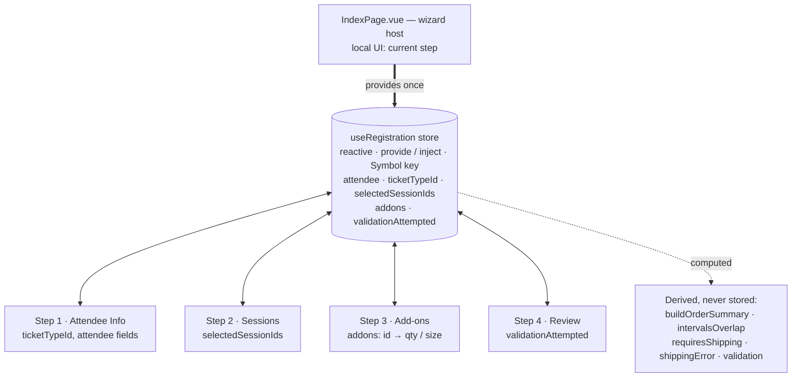

# PLAN.md — Development Journal

> Event Registration Wizard · WebDev Summit 2028 · Nitra FE Assessment
> This is a living document, updated as the work progresses.

---

## 1. Task breakdown & execution plan

I read both the assignment brief (authoritative) and `README.md` (step-level spec) before starting. The app is a 4-step wizard backed entirely by mock data in `src/mocks/` — no backend. I broke the work into phases, each landing as its own atomic commit so the git history reflects the real build order:

0. **Scaffold** — folder structure, dependencies, i18n boot, `QStepper` shell, shared cross-step state via a composable + `provide`/`inject`, empty step components wired to navigation.
1. **Step 1 — Attendee Info** — text/email/tel fields via `defineModel`, three single-select ticket cards. No inline validation (deferred to Step 4 per spec).
2. **Step 2 — Session Selection** — parse + group sessions by day, capacity-full disabled state, multi-select, conflict-detection groundwork.
3. **Step 3 — Add-ons** — group by category (workshops / meals / merchandise), workshop↔session time-conflict → unavailable, size + quantity pickers, shipping banner on merch selection, live order summary.
4. **Step 4 — Review & Submit** — itemized summary, per-section edit-jump, unified validation across all steps, step-level error indicators + navigation, success screen.
5. **Design fidelity pass** — match the Figma design, all interactive states (hover / disabled / error / active), semantic tokens only.
6. **Polish & nice-to-haves** — transitions, loading/disabled states, i18n coverage, responsive/mobile layout.

## 2. Architectural decisions & design rationale

**Cross-step state — composable + `provide`/`inject`.**
A single `useRegistration` composable owns the wizard's reactive state (attendee info, ticket type, selected session IDs, selected add-ons with size/quantity). `IndexPage.vue` provides it once; each step injects it. This keeps all form data alive across forward/backward navigation without prop-drilling, and is the pattern the brief calls out explicitly. Pinia would be overkill for a single-wizard, single-route app and isn't in the starter.

The store (`src/composables/useRegistration.js`) is the only source of truth — it holds raw user input/selections; everything else (pricing, conflicts, field/validation states) is derived with `computed` and never duplicated. The "current step" is local UI state in `IndexPage`, deliberately kept out of the registration store.

**Derived state via `computed`, not `watch`.**
Pricing totals, VIP discounts, time conflicts, capacity/availability flags, and validation results are all pure functions of the source state, so they're modeled as `computed`. `watch` is reserved for genuine side effects only. (This is a stated evaluation criterion and also simply correct here.)

**`defineModel` for form inputs.**
Vue 3.5 (repo pins 3.5.17) supports `defineModel`, so two-way-bound field components use it instead of manual `modelValue` + `update:modelValue`.

**Component decomposition.**
Step containers (`StepAttendeeInfo`, `StepSessionSelection`, `StepAddons`, `StepReview`) compose small presentational components (`TicketCard`, `SessionCard`, `AddonCard`, `MerchandiseCard`, `OrderSummary`, `QuantityPicker`, `ReviewSection`, `SuccessScreen`). Business logic lives in **pure, dependency-free utils** (`utils/pricing`, `utils/validation`, `utils/datetime`, `utils/currency`) rather than composables — they take state in and return data out, so they're trivially testable and the components stay presentational. The one composable, `useRegistration`, owns *state*, not logic.

**Time-conflict algorithm.**
Two intervals overlap iff `aStart < bEnd && bStart < aEnd` (compared on epoch millis). One helper serves both session↔session and workshop↔session checks. The mock data ships intentional overlaps (documented in `sessions.js`) to exercise this.

**Pricing rules.**
Grand total = ticket price + Σ add-ons. Workshops get **10% off for VIP** ticket holders; merchandise multiplies price × quantity; sessions are free. All currency rendered as `$X,XXX.XX`.

**Validation strategy — one zod schema, run by vee-validate, many surfaces.**
No inline validation runs before Step 4. The rules live in a single **zod** schema (`utils/validation.js`): required attendee fields, email/phone format, ticket selection, plus the cross-step business rules in one `superRefine` — conditional shipping (when merchandise is selected), session↔session time conflicts, and merchandise-size-not-chosen. Messages are i18n **keys**, not strings. **vee-validate** runs the schema: the store sets up `useForm({ validationSchema: toTypedSchema(registrationSchema) })`, and because inputs stay bound to the central store (not to vee-validate fields), Step 4's Submit pushes the flattened store values in and calls `validateAll()` imperatively. The flat `{ path: messageKey }` result is reshaped once into the structure the views consume — a step-tagged issue list (path → step via a small map), a per-field lookup, and per-step error flags — exposed as a shared `computed` (`validation`). So every surface reads the same result: Step 1 shows per-field errors, Step 4 shows the error banner + red section borders, and the stepper marks the offending steps. Everything is gated behind a `validationAttempted` flag that only Submit flips; after that first attempt a `watch` on the store re-runs validation so errors clear/reappear live. On failure the wizard stays on Review, scrolls to + focuses the banner, and surfaces every issue (banner + Edit links + red stepper) so the user can jump straight to a problem; on success it generates a confirmation number and shows the success screen.

> **Why a library here (and why not the hand-rolled version I started with).** I first wrote the validator by hand. It worked, but the field-format rules (email/phone regex especially) are exactly the brittle, easy-to-get-subtly-wrong part that a tested schema library removes. zod gives declarative, composable rules as a single source of truth; vee-validate is the Vue-native orchestration layer for running it. The honest caveat: vee-validate's headline value is per-*field* binding (touched/dirty/blur), which this app deliberately doesn't use — state is a central store and validation is a single deferred submit. So vee-validate is used in its imperative `useForm().validate()` mode, and the field params zod can carry (e.g. the names in a conflict message) are flattened away by the vee-validate adapter, so those two messages are phrased generically. A reasonable alternative would have been zod alone; vee-validate was chosen to use the Vue-ecosystem standard and to leave room for per-field UX later.

**Track badge colours — deterministic, not copied from the mockup.**
The Figma colours the session-track badges inconsistently: two FRONTEND sessions get different colours (one orange `orange/50`+`orange/600`, one yellow `yellow/200`+`yellow/900`), so there is no per-track rule to copy. I instead assigned one distinct palette colour per track — `main → gray`, `frontend → orange`, `backend → blue`, `devops → yellow` — so the colour actually encodes the track (a blue badge always means backend). Full/disabled sessions mute the badge to gray, matching the design's disabled card. Judgment call: a consistent mapping beats faithfully reproducing the mockup's ad-hoc colouring.

**Design-source observations — inconsistencies in the Figma, and how I resolved them.**
A couple of places where the design source contradicts itself; in each I implemented one consistent rule rather than reproducing the artifact, and noted it here so the deviation is intentional and reviewable:

1. **Label / badge colours aren't defined as a clear rule.** Beyond the track badges above, the design has no single token mapping for its category/label colours — the same semantic label is coloured differently across frames. Rather than copy per-frame colours, I derive colours from a deterministic rule (per-track palette for session badges; semantic tokens everywhere else).

2. **An undocumented brand-coloured/bold line in the order summary — read as "merchandise".** In the source, one summary line is rendered in the brand colour and visually heavier (teal, bold) with no documented reason (Figma: a 13px `text/brand/emphasis` label vs. the muted `body/sm` lines around it). It first looked like an arbitrary "last item" highlight, but the highlighted line is consistently a **merchandise** product (e.g. the teal `Sticker Pack × 3` line). I read the design's intent as *merchandise line items are visually distinguished from the ticket / workshop / meal lines* — which gives the highlight a meaning (it marks the shippable goods) instead of landing on whatever item happens to be last. So merchandise summary lines render in `text-brand-emphasis` (medium weight) while the others stay muted, applied consistently in both the live order summary (Step 3) and the review pricing (Step 4); the discount stays its own brand-coloured line and only the Total is bold. This is an interpretation — the source never states the rule — but a consistent, meaningful one beats reproducing the artifact verbatim.

3. **The success screen has no summary in the design, but the spec asks for one.** The Figma "Success State" frame shows only the confirmation (check, green title, confirmation number, short note) — no order recap — yet the *review* page does have a pricing summary, and the README explicitly asks for "a confirmation screen **with a summary**." Rather than silently pick one over the other, I followed the spec and placed the design's own order-summary card on the success screen (centred, left-aligned), so the user keeps a record of what they registered for, styled consistently with the rest of the app and without inventing a new visual. (Noted because it's a deliberate deviation from that specific Figma frame.)

4. **The Figma says "2025"; the brief + data say "2028".** The Figma frames label the event "WebDev Summit 2025" (and the success-state mock even references "TechConf 2025"), but the assignment brief and `mocks/event.js` both name it **"WebDev Summit 2028"**. I treated the data as the source of truth: the event name is rendered from `event.name` (data-driven, never hardcoded), so the header reads "WebDev Summit 2028" and stays correct if the data changes — rather than reproducing the mockup's stale year. Same reasoning for the confirmation copy (it interpolates the real `event.name`, not "TechConf 2025").

5. **A merchandise name embeds a size that contradicts its size selector.** `mocks/addons.js` names `merch4` `Laptop Sleeve (15")` yet also gives it `sizes: ['13"', '15"', '16"']` — so picking 13" leaves the hardcoded "(15")" in the product name, which reads as a contradiction. The chosen size *is* captured correctly (`addons.<id>.size`, shown by the picker and appended in the order summary, e.g. "… — 13\""); only the name's literal "(15")" is the mock's own inconsistency. I left the mock untouched (it stands in for an API I don't own) and treat the `size` field as the source of truth — in a real project I'd flag the product name to whoever owns the catalog.

**Nice-to-haves, built in from the start (in scope).**

- **i18n** via `vue-i18n` — every user-facing string goes through a translation key from day one (avoids a costly retrofit later), and a `zh-TW` locale ships alongside `en-US` with a language switcher + browser auto-detection. The mock *content* (session/add-on/ticket names) is also localized via `useCatalog()`, keeping proper nouns in English; dates and currency are formatted per active locale (`Intl`). See §3 for the dependency rationale.
- **Responsive / mobile** — layouts are built mobile-first using the project's UnoCSS breakpoints (`tablet: 768px`, `desktop: 1024px`); the content column and stepper degrade gracefully on narrow screens (full mobile polish noted as future work in §6).

## 3. Dependency choices & trade-offs

Added runtime dependencies: **vue-i18n**, and **vee-validate** + **@vee-validate/zod** + **zod** for validation.

| Dependency | Problem it solves | Alternatives considered |
| ---------- | ----------------- | ----------------------- |
| **vue-i18n** | i18n is a listed nice-to-have; baking it in from the start avoids a costly retrofit of every hardcoded string later. Quasar has first-class integration. | Hand-rolled message map (no pluralization/number-format infra); deferring i18n (rejected — far cheaper to do up front). |
| **zod** | Declarative, well-tested schema for the unified validation — replaces hand-rolled regex/required checks that are easy to get subtly wrong. One source of truth for every rule. | Hand-rolled validator (works, but brittle email/phone rules); yup (similar, but zod is the more modern Vue/TS-ecosystem default). Pinned to **v3** (`^3.25`) because `@vee-validate/zod` peer-requires zod `^3.24`. |
| **vee-validate** + **@vee-validate/zod** | The Vue-native way to run a schema and orchestrate submit-time validation. `toTypedSchema` adapts the zod schema; `useForm().validate()` runs it. | zod alone (would have been lighter — vee-validate's per-field binding is unused here since state is a central store + deferred submit). Chosen to use the ecosystem standard and leave room for per-field UX. **Trade-off noted in §2.** |

> **date-fns — evaluated, then removed.** It was added during scaffolding for date handling, but the session/workshop timestamps are fixed UTC ISO strings (`…Z`) and the design renders them as UTC wall-clock times (`09:00Z` → "9:00 AM" for every viewer). `Intl.DateTimeFormat({ timeZone: 'UTC' })` does this correctly in one call, whereas date-fns' `format()` runs in the viewer's local zone — matching the design would have meant adding `date-fns-tz` on top. Time formatting, day-grouping and interval-overlap are all trivial with native `Date`/`Intl` (`src/utils/datetime.js`), so date-fns was removed rather than left as an unused dependency. Currency uses the built-in `Intl.NumberFormat`.

## 4. AI-assisted development & reflection

Primary tool: **Claude Code** (interactive agent), used throughout. Notable sessions so far:

- **Environment upgrade.** The repo pins Node 22.17.0 / Yarn 4.6.0 but the machine was on Node 20 / Yarn 1. Claude diagnosed the toolchain (identified `n` as the active manager vs. a stray `nvm`), upgraded via `n` + Corepack, and cleaned up ~1.4 GB of redundant old Node versions. What worked: letting it inspect the environment first rather than guessing the version manager. Where I stayed in the loop: `sudo` steps were run by me, not the agent.
- **Onboarding docs.** Generated `CLAUDE.md` (architecture + conventions) and recorded the team convention that all in-file comments must be English.
- **Planning.** Used Claude to turn the brief + README into the phased plan and architecture decisions above, choosing patterns against the published evaluation weights.

**Representative prompts → corrections (Step 1).**
The most useful thing I did was treat the agent's output as a *draft* and keep probing it. A few of the real prompts that actually drove quality:

- *"Why use a `<button>` for the ticket card?"* — Claude confirmed a `<button>` wrapping `
/
/<ul>` is invalid HTML, and that a single-select group is semantically a radiogroup, then refactored the cards to a WAI-ARIA `radiogroup` (roles, `aria-checked`, roving `tabindex`, arrow-key nav, focus-visible ring).
- *"Where do those extra 13px come from?"* — I had it measure with Playwright instead of guessing: the label→input gap was 8px instead of the Figma's 6px (×4 rows = 8px); the remaining ~4px was a border-box-vs-Figma-frame measurement difference, not a real gap.
- *"Do we really need these inline `style` tags — don't we have UnoCSS?"* — moved the dividers and the 1200 width off inline styles into `divider-b` / `divider-t` and `wizard-shell` shortcuts.
- *"Why doesn't `q-py-[1.5]` change anything?"* — it's an invalid class, and a `q-btn`'s `min-height: 36px` floor swallows padding anyway; switched to Quasar's `padding` prop to hit the Figma 192×40 button.
- *"The completed stepper line should change colour."* — this caught an earlier wrong conclusion of mine-via-Claude ("connectors are a single grey"), which had been drawn from only the Step-1 state where nothing is completed.

**Multi-agent self-review — and catching the AI being wrong on *logic*, not just pixels.** Near the end I ran a panel of review agents over the whole codebase against the evaluation rubric. Most surfaced real issues I then fixed (text inputs not linked to their error message via `aria-describedby`; hardcoded `rgba()` card shadows that should be a `shadow-card` token; the stepper buttons missing `aria-current`/focus ring). But I treated the agents' output as a draft too, and two findings were wrong or overstated:
- One agent claimed the validation `watch`'s `deep: true` was *redundant overhead*. I verified the opposite: `toFormValues()` reads `selectedSessionIds`/`addons` as **references**, so without `deep`, adding a session or changing an add-on quantity wouldn't re-trigger the live re-validation. Removing it would have silently broken Steps 2–3 error-clearing — so I kept it and documented *why*.
- Another rated the un-clamped merchandise `maxQuantity` as a high-severity overcharge bug. I traced the data flow, confirmed the `QuantityPicker` hard-caps quantity (`:disabled="model >= max"`) with no bypass path in this app, downgraded it to defence-in-depth — then added the clamp in `pricing.js` anyway because it's cheap insurance.

**What worked / what didn't.**

> **How I verified — Playwright *and* DevTools, not just one.** Two complementary loops: scripted Playwright runs drove the flows end-to-end and captured full-page screenshots to diff against the Figma frames, while Chrome DevTools was used by hand to inspect the *rendered* result — the **Elements** panel for the actual DOM structure and ARIA roles/`tabindex` (confirming the radiogroup/checkbox/tablist markup really emitted), and the **Computed** panel for the *resolved* CSS, which is how the token/class bugs were caught (e.g. a badge's computed `color` resolving to Quasar's `.text-warning` instead of the UnoCSS token, or a field's box-model measured against the Figma px). Screenshots tell you it looks wrong; the Computed panel tells you *which* declaration won.

| Worked | Didn't — needed steering |
| --- | --- |
| Handing Claude the Figma node via the MCP so it mapped to the repo's semantic tokens instead of inventing hex | First Step-1 pass "matched the tokens" but used the wrong typeface — looked off until we pulled the exact spec |
| Making it *measure* — Playwright scripts for flow/screenshots **plus** DevTools (Elements for DOM/roles, Computed for resolved CSS) — rather than eyeball | Concluded the stepper connectors were one colour from a single state; wrong once steps complete |
| Pulling exact values with `get_variable_defs` instead of guessing | Reached for inline `style` and a hardcoded stepper height instead of the token + shortcut system |
| Asking "why this element / value?" — surfaced the invalid `<button>` and the `q-btn` min-height floor | Used `<button>` with block content (invalid) and `q-py-[1.5]` (a class that doesn't exist) |

## 5. Key challenges & technical solutions

- **Toolchain mismatch on a clean machine.** `yarn install` failed the engine check (Node 20 vs required 22). Resolved by standardizing on `n` for Node and Corepack for Yarn 4, so the versions are enforced by `package.json` (`engines` + `packageManager`) for any future checkout. Also added Yarn 4's `.gitignore` rules so the regenerable `.yarn/install-state.gz` cache isn't committed.
- **"Matches the tokens" ≠ "matches the design" (typeface fidelity).** The first Step-1 pass mapped layout + semantic colour tokens correctly but still looked wrong: Quasar ships no Roboto here, so text fell back to the system font while the design uses **Inter**. Rather than eyeballing, one `get_variable_defs` call pulled the exact spec — font = Inter, heading = h3/24 (not 28), input field radius = 6px — and all were corrected (self-hosted Inter via `@fontsource-variable/inter`, fixed type scale, 6px field radius). Lesson logged: verify the rendered typeface and exact values, not just the colour names.
- **UnoCSS has no border/divider preflight.** A plain `border-b` rendered nothing (no default `border-style`). Built `divider-b`/`divider-t` inset-shadow shortcuts for the chrome hairlines; and the summary separator briefly relied on a custom `divider-line` shortcut that the dev server didn't reliably apply (config-shortcut HMR/cache) — switched it to explicit per-class utilities (`h-px w-full bg-[var(--divider-muted,…)]`), which always regenerate on a `.vue` change.
- **Quasar ↔ UnoCSS class collisions.** Quasar's global `.text-warning`/`.text-info` shadow the same-named UnoCSS semantic classes (rendering the wrong colour — this bit the Step-2 capacity bar and the Step-3 info banner), and Quasar's `.flex` adds `flex-wrap` (unlike UnoCSS's plain `display:flex`). Fixed by using palette utilities (`text-yellow-800`, `text-blue-500`) for those tones and `flex-1 min-w-0` on growable children. Caught in the DevTools **Computed** panel (the resolved `color` traced back to Quasar's global rule, not the UnoCSS token), not by eyeballing.
- **`prefers-reduced-motion` froze the loading spinner.** My blanket reduced-motion rule (`animation-duration: 0.01ms !important`) also stopped the submit spinner, so under "Reduce motion" it didn't appear to spin. Exempted `.q-spinner` — a spinner is functional progress feedback, not decorative motion — while still neutralising transitions + smooth scroll.
- **Browser autofill background.** Chrome paints autofilled fields with its own colour (forced `!important`), which a normal `background-color` can't override; repainted them to the design surface with the inset `box-shadow` trick + `-webkit-text-fill-color`.

## 6. Future improvements (given more time)

- **Persist state.** A page refresh loses the in-progress registration. With more time I'd mirror the store to `sessionStorage` (or the URL) so a reload — or an accidental Edit-link round-trip — keeps the user's selections.
- **Round out accessibility.** After the review pass, field errors are linked to inputs (`aria-describedby`), the stepper exposes `aria-current` + a per-step `aria-label` (so collapsed-on-mobile steps still announce), focus moves into each step on navigation, and every control has a focus ring. Still partial: the day/category tablists aren't fully wired to the WAI-ARIA tabs pattern (`aria-controls` / `aria-labelledby`), and the session-conflict cue isn't announced via `aria` on the card.
- **Responsive.** The layout degrades sensibly below 1200px and the stepper collapses its labels, but a real mobile pass (<768px touch-target sizing, denser cards) isn't fully designed or tested — the Figma only ships a 1440 frame.
- **Tokenise the remaining arbitraries.** Spacing now uses the numeric step scale (`p-4`, `gap-6`) and on-scale radii were converted (`rounded-2`). What's left in brackets is intentional and accounted for — all of it maps to an exact Figma value with no name in this project's scales: (1) **radii** off the step scale — `rounded-[6px]` (the `border-radius/m` token), the 1–3px hairline radii on the capacity bar/checkbox, and the 10px pill on tabs/buttons; (2) **sub-`sm` type** — `text-[10px|11px|12px|13px]` and their `leading-[14px|16px]`, since the named type scale only defines `lg/md/sm`; (3) a few **fixed pixel dimensions** — the 28×15 logo asset, the 72px header row, the 420px success-card cap, and the `1fr 380px` summary grid. The one `var()`-based bracket (`bg-[var(--divider-muted,…)]`) references a token directly. These could become named tokens if the design system grows; left explicit for now because the px intent reads clearer than an invented scale step.
- **Tests.** Out of scope per the brief, but the pricing and time-conflict logic are the parts I'd most want unit/component tests around before trusting them.
